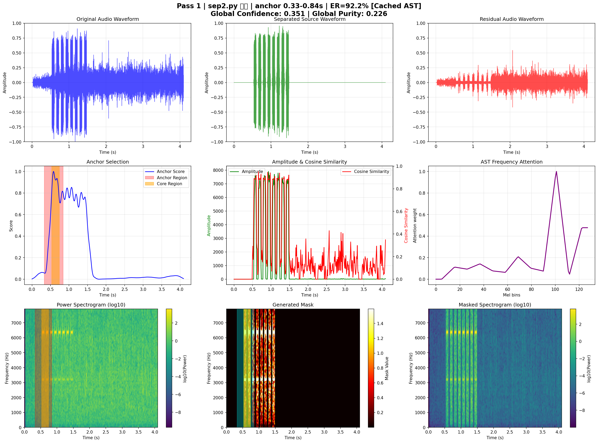

# ast_source_sep
# Cached AST-guided Source Separator

AST(Audio Spectrogram Transformer) 모델을 활용한 지능형 음원 분리 시스템입니다. 주파수 어텐션 맵 캐싱을 통해 AST 모델 호출을 최적화하고, 소리 크기에 따른 적응적 분리 전략을 제공합니다.


## 🎯 주요 특징

- **캐싱 최적화**: AST 모델 호출을 3번으로 제한하여 성능 향상
- **적응적 분리**: 소리 크기에 따른 보수적/공격적 분리 전략
- **실시간 분류**: 분리된 소리를 실시간으로 분류 및 백엔드 전송
- **디버그 시각화**: 분리 과정의 상세한 시각화 제공

## 🚀 설치 및 실행

### 필수 요구사항

```bash
pip install torch torchaudio transformers matplotlib numpy requests
```

### 기본 사용법

```bash
python sep2.py --input mix.wav --output output_dir
```

### 고급 옵션

```bash
python sep2.py \
  --input mix.wav \
  --output output_dir \
  --model MIT/ast-finetuned-audioset-10-10-0.4593 \
  --device auto \
  --max-passes 3 \
  --min-eratio 0.01 \
  --debug
```

## 📋 명령행 옵션

| 옵션 | 설명 | 기본값 |
|------|------|--------|
| `--input`, `-i` | 입력 오디오 파일 (필수) | - |
| `--output`, `-o` | 출력 디렉토리 (필수) | - |
| `--model`, `-m` | AST 모델 이름 | `MIT/ast-finetuned-audioset-10-10-0.4593` |
| `--device`, `-d` | 연산 장치 (auto/cpu/cuda) | `auto` |
| `--max-passes` | 최대 분리 패스 수 | `3` |
| `--min-eratio` | 분리 계속을 위한 최소 에너지 비율 | `0.01` |
| `--backend-url` | 백엔드 API URL | `http://13.238.200.232:8000/sound-events/` |
| `--debug` | 디버그 시각화 활성화 | `False` |
| `--no-debug` | 디버그 시각화 비활성화 | `False` |

## 🎵 소리 분류 시스템

### 분류 카테고리

- **Danger**: 위험한 소리 (알람, 경고음 등)
- **Help**: 도움 요청 소리 (구조 요청 등)
- **Warning**: 경고 소리 (주의 신호 등)
- **Other**: 기타 소리

### 분류 ID 매핑

```python
DANGER_IDS = {396, 397, 398, 399, 400, 426, 436}
HELP_IDS = {23, 14, 354, 355, 356, 359}
WARNING_IDS = {288, 364, 388, 389, 390, 439, 391, 392, 393, 395, 440, 441, 443, 456, 469, 470, 478, 479}
```

## ⚙️ 핵심 파라미터

### 오디오 처리 설정

```python
SR = 16000                    # 샘플링 레이트
WIN_SEC = 4.096              # 윈도우 크기 (초)
ANCHOR_SEC = 0.512           # 앵커 크기 (초)
N_FFT, HOP, WINLEN = 400, 160, 400  # STFT 파라미터
N_MELS = 128                 # Mel 스펙트로그램 빈 수
```

### 분리 전략 파라미터

```python
# 템플릿 생성
OMEGA_Q_CONSERVATIVE = 0.9   # 보수적 전략: 상위 10% 주파수
OMEGA_Q_AGGRESSIVE = 0.7     # 공격적 전략: 상위 30% 주파수

# AST 주파수 어텐션
AST_FREQ_QUANTILE_CONSERVATIVE = 0.7  # 보수적: 상위 30% 어텐션
AST_FREQ_QUANTILE_AGGRESSIVE = 0.4    # 공격적: 상위 60% 어텐션

# 마스킹 전략
MASK_SIGMOID_CENTER = 0.6    # 마스킹 중심값
MASK_SIGMOID_SLOPE = 20.0    # 마스킹 기울기
```

## 🎛️ 적응적 분리 전략

### 소리 크기 판단 기준

```python
is_weak_sound = energy_ratio < 0.1  # 전체 에너지의 10% 미만
```

### 작은 소리 (Weak Sound)
- **더 보수적인 마스킹**: 높은 중심값으로 확실한 소리만 분리
- **엄격한 주파수 선택**: 상위 20% 주파수만 사용
- **높은 임계값**: 노이즈 제거를 위한 엄격한 기준

### 큰 소리 (Normal Sound)
- **기본 마스킹**: 표준 분리 전략 적용
- **균형잡힌 주파수 선택**: 상위 30% 주파수 사용
- **표준 임계값**: 일반적인 분리 기준

## 📊 출력 파일

### 오디오 파일
- `00_separated.wav`: 첫 번째 분리된 소리
- `01_separated.wav`: 두 번째 분리된 소리
- `02_separated.wav`: 세 번째 분리된 소리
- `03_residual.wav`: 잔여 소리

### 디버그 이미지 (--debug 옵션)
- `debug_pass_1.png`: 첫 번째 패스 시각화
- `debug_pass_2.png`: 두 번째 패스 시각화
- `debug_pass_3.png`: 세 번째 패스 시각화

## 🔧 성능 최적화

### AST 모델 호출 최적화
- **캐싱 시스템**: 어텐션 맵과 주파수 어텐션을 캐싱
- **3회 제한**: 최대 3번의 AST 모델 호출로 성능 향상
- **메모리 효율성**: 불필요한 재계산 방지

### 연산 최적화
- **멀티스레딩**: `torch.set_num_threads(4)` 설정
- **GPU 지원**: CUDA 자동 감지 및 활용
- **배치 처리**: 효율적인 텐서 연산

## 📈 성능 지표

### 목표 성능
- **실행 시간**: 4초 이내
- **AST 호출**: 3회 이내
- **에너지 보존**: 95% 이상

### 모니터링
```python
# 성능 로그 예시
✅ SUCCESS: Completed in 3.2s (< 4s target)
✅ SUCCESS: Used 3 AST calls (<= 3 target)
```

## 🐛 문제 해결

### 일반적인 오류

1. **차원 불일치 오류**
   ```
   RuntimeError: size mismatch, got input (128), mat (128x201), vec (128)
   ```
   - 해결: Mel-Linear 도메인 변환 로직 확인

2. **torchaudio 로딩 오류**
   ```
   OSError: [WinError 127] 지정된 프로시저를 찾을 수 없습니다
   ```
   - 해결: `pip install torchaudio==2.5.1 --force-reinstall`

3. **메모리 부족**
   - 해결: `--device cpu` 옵션 사용
  
     

## 📝 라이선스

이 프로젝트는 연구 및 교육 목적으로 개발되었습니다.

## 🤝 기여

버그 리포트나 기능 제안은 이슈를 통해 제출해 주세요.

---

**개발자**: AST-guided Source Separation Team  
**버전**: 2.0  
**최종 업데이트**: 2024년 9월
